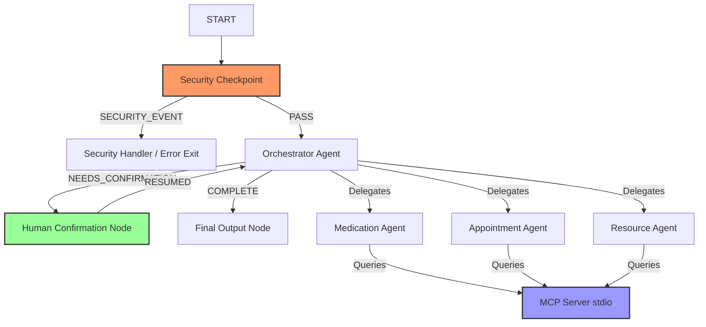

# 👵 Submission Write-Up: ElderlyCareGuide Concierge Agent

## 1. Problem Statement
Managing healthcare requirements for elderly individuals is complex and error-prone. Caregivers and seniors frequently struggle to coordinate multiple care tasks, including:
* **Medication adherence & scheduling**: Tracking refill dates and verifying drug compatibility to prevent dangerous interactions.
* **Clinic visits**: Accessing doctor availability, booking slots, and managing schedules.
* **Accessing support resources**: Locating eldercare centers, medical transport, and specialized geriatric clinics.

This agent acts as a secure, ambient, and intelligent assistant to guide seniors and caregivers through these tasks while ensuring data security and validation.

---

## 2. Solution Architecture
The concierge agent leverages a structured workflow graph built with Google ADK 2.0. The graph contains a primary delegator orchestrator, specialized sub-agents, local MCP toolsets, and validation checkpoints.

---

## 3. ADK Concepts Used
This implementation leverages several core components from the Google ADK library:

* **ADK Workflow**: Configured in [agent.py](file:///c:/Users/ksreshtha/OneDrive%20-%20Red%20Nucleus/Desktop/Google_Kaggle_5Day_AI_Agents/Capstone/MyProject/Capstone%20Project%202026/elderlycareguide-concierge/app/agent.py#L341-L352), managing states and structured transitions between nodes.
* **LlmAgent & AgentTool**: Structured agents (`medication_agent`, `appointment_agent`, `resource_agent`) mapped in [agent.py](file:///c:/Users/ksreshtha/OneDrive%20-%20Red%20Nucleus/Desktop/Google_Kaggle_5Day_AI_Agents/Capstone/MyProject/Capstone%20Project%202026/elderlycareguide-concierge/app/agent.py#L126-L190). The orchestrator delegates queries dynamically to these sub-agents using `AgentTool`.
* **Model Context Protocol (MCP) Server**: A custom stdio-based MCP server in [mcp_server.py](file:///c:/Users/ksreshtha/OneDrive%20-%20Red%20Nucleus/Desktop/Google_Kaggle_5Day_AI_Agents/Capstone/MyProject/Capstone%20Project%202026/elderlycareguide-concierge/app/mcp_server.py) providing specialized tools mapped to python business logic.
* **Security Checkpoint Node**: An initial gatekeeper node defined in [agent.py](file:///c:/Users/ksreshtha/OneDrive%20-%20Red%20Nucleus/Desktop/Google_Kaggle_5Day_AI_Agents/Capstone/MyProject/Capstone%20Project%202026/elderlycareguide-concierge/app/agent.py#L211-L242) that sanitizes inputs before they reach the LLM agents.
* **Context State (`ctx.state`)**: Utilized to share session state (like drafted appointments and confirmation flags) across node boundaries asynchronously.

---

## 4. Security Design
Because this agent processes healthcare and personal data, the following security controls are implemented inside `security_checkpoint`:

1. **PII Scrubbing & Redaction**: Input strings are scanned using regular expressions to detect and redact:
   * Phone Numbers (e.g. `\+?\d{1,4}?[-.\s]?\(?\d{1,3}?\)?[-.\s]?\d{1,4}[-.\s]?\d{1,4}[-.\s]?\d{1,9}`)
   * Email Addresses (e.g. `[a-zA-Z0-9._%+-]+@[a-zA-Z0-9.-]+\.[a-zA-Z]{2,}`)
   * Social Security Numbers / SSNs (e.g. `\b\d{3}-\d{2}-\d{4}\b`)
2. **Prompt Injection Mitigation**: Incoming user messages are matched against common injection command keywords (`"ignore previous instructions"`, `"system prompt"`, `"override rules"`, `"bypass checkpoint"`). If detected, the input is immediately routed away from the main agent to `security_handler` for termination.
3. **Structured Audit Log**: Every validation decision publishes a structured JSON log containing timestamp, category, status, and severity (`INFO`, `WARNING`, `CRITICAL`), ensuring a comprehensive tamper-proof audit trail for healthcare compliance.

---

## 5. Model Context Protocol (MCP) Server Design
The stdio-based MCP server exposes specialized tools to query mocked backends:

* `get_refill_status(medication_name: str)`: Returns remaining refills and prescription expiry dates.
* `get_doctor_availability(doctor_name: str)`: Queries schedule slots for geriatric and primary care doctors.
* `search_local_clinics(zip_code: str)`: Returns nearby clinics offering eldercare-specific services.
* `search_elder_transport(zip_code: str)`: Identifies senior transport programs and transport options.

These tools are dynamically wired into the specialized sub-agents using `McpToolset`.

---

## 6. Human-in-the-Loop (HITL) Flow
To guarantee safety and prevent accidental bookings, the appointment scheduling flow implements a strict HITL checkpoint:
1. When a user requests to book a clinic slot, `appointment_agent` registers a draft booking and stores it in `ctx.state`.
2. The orchestrator returns an event with the `NEEDS_CONFIRMATION` route, transferring control to the `human_confirmation_node`.
3. The workflow pauses and yields a `RequestInput` payload to the interface, prompting the user for approval.
4. Once the user replies with `"yes"` or `"no"`, the event loop resumes, processing the confirmed booking or clearing the draft from state.

---

## 7. Demo Walkthrough & Test Results
* **Refill Query**: When queried about medication refills, the agent correctly parses the target medication name, invokes the database connector via the MCP server, and formats the output.
* **Security Validation**: Testing with input containing `ignore previous instructions` triggers the `security_checkpoint` logic, terminating the session immediately and logging the threat.
* **Pausing for Confirmation**: Executing a booking request shows a pending draft status in state, with the workflow halting until the client sends a confirmation response.

---

## 8. Impact & Value Statement
This agent significantly reduces the administrative burden on seniors and their caregivers by consolidating scheduling, support resources, and schedules under a single interface. By combining a strict security checkpoint with a safety-first human-in-the-loop validation step, the concierge offers a compliant, secure, and helpful companion for elderly care management.
